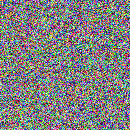
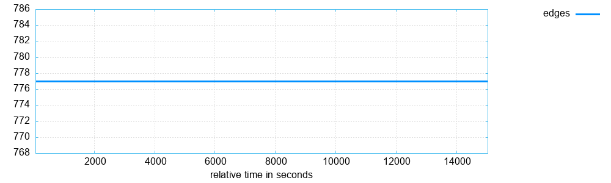
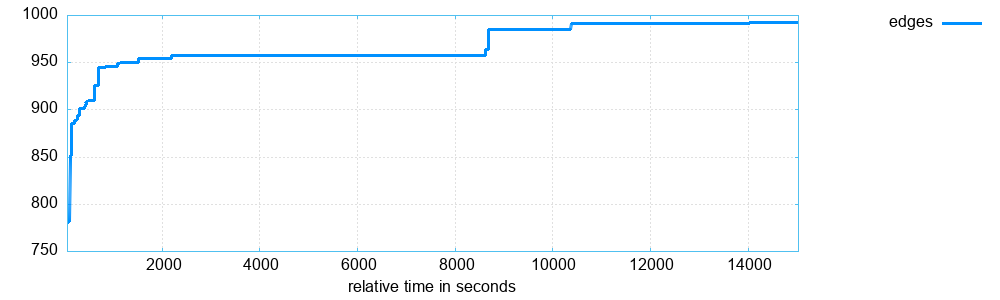
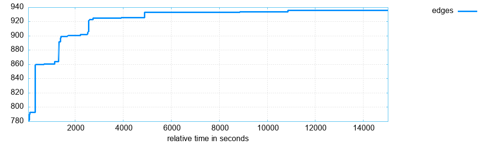
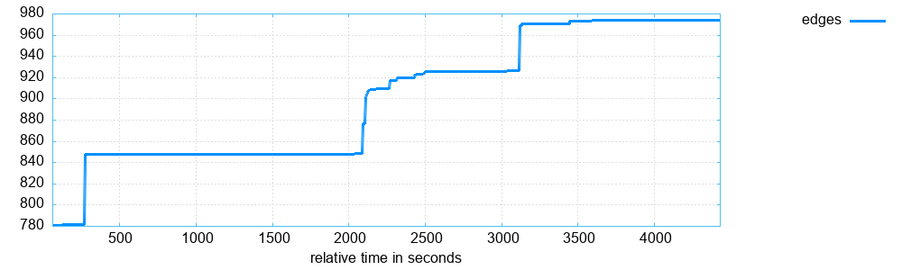
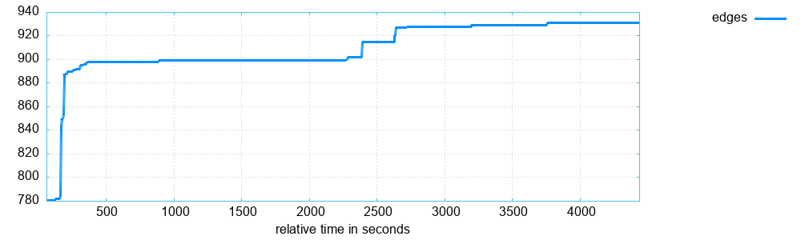

# Через тернии к фаззингу
Чтобы увеличить эффективность фаззинга, я написал кастомную мутацию для файлов формата png.

### Простейший png файл имеет следующую структуру:


[Источник изображения](https://habr.com/ru/articles/130472/)


Файл состоит из чанков - блоков с такой структурой


[Источник изображения](https://habr.com/ru/articles/130472/)

Длина - целое число, хранящее длину блока данных в байтах

Тип - IDAT/IHDR/...

Данные - понятно

CRC - хеш , высчитывающийся для полей тип и данные

Нужную ее реализацию я долго искал и в конце концов нашел на [сайте спецификаций png](http://www.libpng.org/pub/png/spec/1.2/PNG-CRCAppendix.html)

## PNG signature
В начале каждого png файла должна быть такая подпись:

`89 50 4E 47 0D 0A 1A 0A`

Поэтому в начале генерации мы должны записать подпись:
```C
unsigned char signature[8] = {0x89, 0x50, 0x4E, 0x47, 0x0D, 0x0A, 0x1A, 0x0A};
fwrite(signature, sizeof(char), 8, picture);
```
## IHDR
Этот чанк должен стоять самым первым, так как он содержит основную информацию об изображении: высота, ширина, глубина, тип цвета... . 

Пример генерации:

```C
    chunk IHDR = {};
    IHDR.length = IHDR_LENGTH;     
    strcpy(IHDR.type, "IHDR");  

    IHDR.data = (char *) calloc(IHDR_LENGTH, sizeof(char));

    IHDR.data[3] = (char) WIDTH;            
    ...

    IHDR.data[7] = (char) HEIGHT;
    ...

    IHDR.data[8] = 8;   // bit depth (bits on pixel) 
    IHDR.data[9] = 2;   // colour type (0 - greyscale, 2 - RGB)

    IHDR.data[10] = 0;  // weave method        (const)
    IHDR.data[11] = 0;  // compression method  (const)
    IHDR.data[12] = 0;  // filtration          (const)
    write_chunk(file, &IHDR);
```

## IDAT
Данный чанк содержит основную информацию об изображении.

Пример генерации:

```C
chunk IDAT = {};
strcpy(IDAT.type, "IDAT");

IDAT.length = WIDTH * HEIGHT * 3;

IDAT.data = (char *) calloc(IDAT.length + 1, sizeof(char));
for (int i = 0; i < IDAT.length; i++) {
    IDAT.data[i] = rand() % 256;
}

write_chunk(file, &IDAT);
```

Но все оказалось не так просто: какие-то вьюеры открывали файл, но подавляющее большинство программ считало файл невалидным. Это было по причине того, что я не использовал сжатие данных. Тогда я добавил сжатие данных с помощью библиотеки `zlib.h`. Также надо было добавить байт фильтра перед каждой строкой.


Пример сжатия данных:
```C
uLongf compressed_size = compressBound(IDAT.length);
unsigned char * compressed_data = (unsigned char *) calloc(compressed_size,1);

int zlib_result = compress(compressed_data, &compressed_size, (const unsigned char *)IDAT.data, IDAT.length);

```

Выставление байтов фильтра:
```C
for (int y = 0; y < HEIGHT; y++) {
    memmove(&IDAT.data[y * (WIDTH * 3 + 1)], &IDAT.data[y * WIDTH * 3], WIDTH * 3);  
    IDAT.data[y * (WIDTH * 3 + 1)] = 0; 
}
```


## IEND
Завершающий чанк, который не несет никакой информации


Пример генерации:
```C
chunk IEND = {};
strcpy(IEND.type, "IEND");
IEND.length = 0;
write_chunk(file, &IEND);
```
И в итоге получается такая красота:



# Проверка эффективности мутации
## Первые тесты

Были запущены три варианта фаззера: только с кастомной мутацией, без кастомных мутаций, кастомные мутации + обычные мутации.

Только с кастомной мутацией:


Без кастомных мутаций:


Кастомные мутации + обычные мутации:


- Почему так плохо?

Вероятно вьюер использует одни и те же алгоритмы для отображения картинок с разными пикселями и разными размерами, поэтому не произошло никакого роста покрытия. Получается, надо добавить генерацию по-разному невалидных pngшек


## Работа над ошибками

* Добавлена рандомизация сигнатуры (или правильный, или рандомный)
* Рандомизация типа и длины чанков, рандомизация типа цвета и глубины и всяких флагов
* Рандомизация crc
* Рандомизация фильтров для сжатия
* Рандомизация сжатия или нет

Но результаты были все еще были удручающими. Как же еще улучшить результат?
Я заметил, что exec speed с моей мутацией в ~ 2 раза медленнее, чем без нее. Я предположил, что скорость можно повысить, избавившись от использования динамической памяти.

Без мутации:


Вместе с ней:


## Вывод
Пусть моя мутация на долгой дистанции проигрывает дефолтной, но на короткой дистанции очень хорошо себя показывает. Это значит, что использование моей мутации может быть оправдано, что не может не радовать.
# Источники

https://iter.ca/post/png/

https://habr.com/ru/articles/130472/

http://www.libpng.org/pub/png/spec/1.2/PNG-Chunks.html

https://habr.com/ru/companies/ruvds/articles/787302/

http://www.libpng.org/pub/png/spec/1.2/PNG-CRCAppendix.html


TODO:

add -I option
make define for checks
formatting check

DONE:

added a target to compile custom mutation
made static const 
made defines for checks
deleted comments with doc
if formatting fix 
crc is now static

